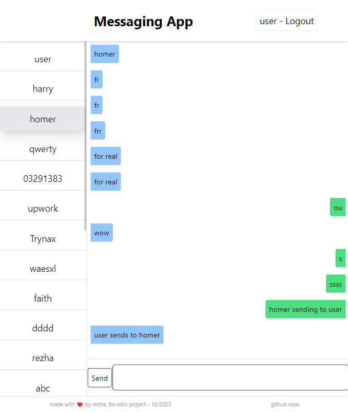

# Messaging App

Backend API repo: <a href="https://github.com/rezha4/messaging-app/" target="_blank" rel="noopener noreferrer">Github - Messaging-App</a>

Live: <a href="https://playful-youtiao-23f51a.netlify.app/" target="_blank" rel="noopener noreferrer">Messaging App - Netlify</a>

Preview:

### Built With

- 
- 
- 
- 

- 

- 

- 

# Overview

I made this project according to The Odin Project (TOP) Node JS, Full Stack Project's section: https://www.theodinproject.com/lessons/nodejs-messaging-app

I think I've done the minimum viable product as per specified by TOP. My app can do authorization, sending messages, but still missing user profile customization.

This project is made with the MERN tech stack, REST-ful API principles, and separated concern between backend and frontend code.

# Insights

I started working on the express API first. After it can do READ process, I started my REACT Frontend separately. Then, I bounce between frontend and backend until my MVP goal is achieved (correctly READ and CREATE messages & users).

I didn't do testing at all, and I regret it. I skipped the testing lessons all around TOP, except the first one (on advanced JS with Jest). This introduces unexpected bugs around my app, and it delays deployment by a lot.

# Acknowledgments
Special thanks to The Odin Project for the guidance and resources provided throughout this project.

Feel free to do a pull requests!
